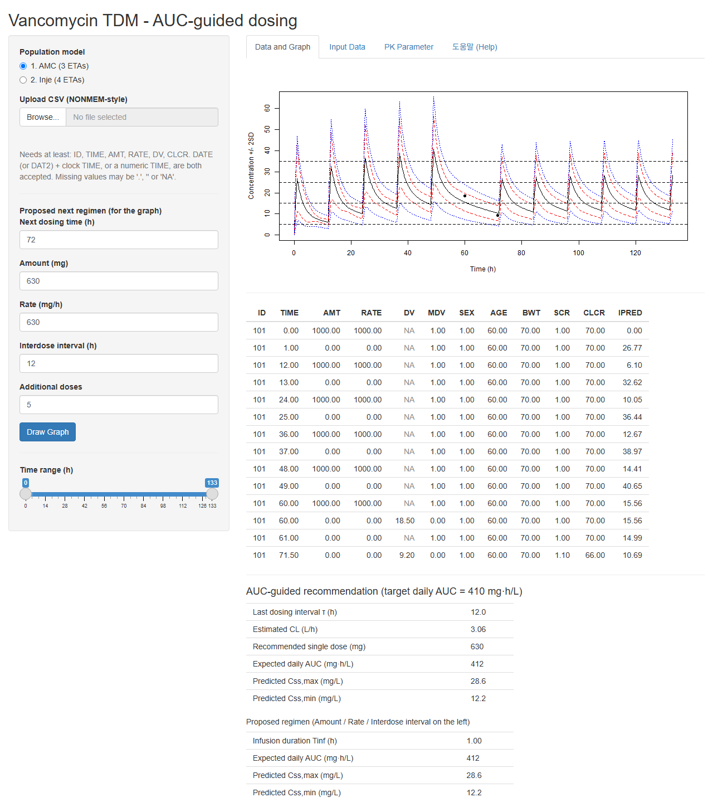

# 약동학 with R - 코드 저장소

*An English description is in [README.md](README.md).*

교재 **『약동학 with R - 이론과 계산을 R로 잇는다』**(배균섭)의 R 코드입니다.

책에 인쇄된 코드가 곧 이 저장소의 파일이고, 책에 실린 콘솔 출력과 그림도 이 코드를 실행해
얻은 것입니다. 그래서 **책의 코드와 실제로 돌아간 코드가 어긋날 수 없습니다.**
값을 바꾸어 다시 돌려 보는 것이 이 책이 권하는 공부 방법입니다.

## 무엇이 들어 있나

| 폴더 | 내용 |
|:--|:--|
| `R/snippets/` | 스니펫 201개. 이름 하나에 파일 하나입니다. `chNN-이름.R` 의 `NN` 이 장 번호이며, 책의 등장 순서는 파일 이름 순서가 아니라 `R/build.R` 의 순서입니다 |
| `output/` | 각 스니펫의 콘솔 출력 200개. `ch11-ctl` 은 NONMEM 제어파일 예문이라 실행하지 않습니다 |
| `figures/` | 각 스니펫이 만든 그림 82개 |
| `R/build.R` | 전부 다시 만드는 스크립트. 장별 세션 경계가 주석에 적혀 있습니다 |
| `R/_freeze.R` | 스니펫 하나를 실행해 출력과 그림을 고정하는 도구 |
| `ACRE/` | 1.7절이 안내하는 ACRE 편집기의 문법 강조 정의(`Syntax/`)와 그 README |
| `TDM-Vanco/` | 13.7절의 vancomycin TDM Shiny 앱 (아래 참조) |

## 실행

```sh
Rscript R/build.R
```

저장소 최상위에서 실행하면 `output/` 과 `figures/` 가 처음부터 다시 만들어집니다.
전체 약 12-15분이 걸리며 대부분은 11장의 FOCE-I 추정과 12장의 RPT, bootstrap 입니다.
스니펫 하나만 보고 싶으면 그 파일을 열어 그냥 실행하면 됩니다.

필요한 패키지는 다음과 같습니다. 별표는 저자가 만든 것입니다.

| 패키지 | 쓰는 장 | 하는 일 |
|:--|:--|:--|
| `NonCompart`* | 5, 9, 10 | 비구획 분석(NCA) |
| `wnl`* | 4, 7, 8, 16, 17 | 비선형 회귀와 오차 모형 |
| `nmw`* | 11, 13 | NONMEM 추정 과정의 R 재현 |
| `BE`* | 14 | 생물학적동등성 분석 |
| `sasLM`* | 14 | SAS PROC GLM 형식의 선형모형 |
| `LBI`* | 3 | 가능도 구간(likelihood interval) |
| `mathr`* | 2 | 수치 계산 도구(기계 엡실론, 구적법, 수치 미분) |
| `deSolve` | 2, 5, 7, 8, 10, 13, 17 | 미분방정식 수치해 |
| `PowerTOST` | 14 | 동등성 시험의 검정력과 표본크기 |
| `nlme` | 5, 14 | 예제 자료와 혼합효과 모형 |

```r
install.packages(c("NonCompart", "wnl", "nmw", "BE", "sasLM", "LBI", "mathr",
                   "deSolve", "PowerTOST", "nlme"))
```

## 알아 둘 것

**세션을 공유하는 장이 있습니다.** 스니펫은 대부분 장마다 독립된 R 세션에서 돌지만, 세 곳은
앞 장의 객체를 그대로 이어받습니다. 같은 자료를 두 방법으로 보거나 같은 함수를 두 번 싣지
않으려는 의도적 설계입니다.

- 5장 → 6장: `Cpo`
- 7장 → 8장 → 9장: `dat2`, `C2iv`, `th`, `D`, `CL`, `tobs` (8장은 7장 세션 안에서 돕니다)
- 11장 → 12장: `DATA`, `PRED`, `TH`, `OM`, `SG`, `EBE`, `r.fo`, `r.foce`, `cov.fo`

이 사이에 세션을 새로 시작하면 뒤 장이 깨집니다. `R/build.R` 의 주석에 그 경계가 적혀
있습니다.

**난수는 씨앗을 고정했습니다.** 시뮬레이션을 쓰는 스니펫은 각자 `set.seed()` 를 가지고 있어
다시 돌려도 책과 같은 숫자가 나옵니다.

**출력과 그림을 저장소에 넣은 이유.** 보통은 생성물을 기록하지 않고 그것을 만든 코드만
기록합니다. 여기서는 R 을 설치하지 않고 코드만 읽는 사람도 결과를 볼 수 있도록 예외를
두었습니다. 대신 그 파일들을 언제든 다시 만들 수 있는 코드가 같은 저장소에 있습니다.

## TDM-Vanco: vancomycin TDM 웹앱

`TDM-Vanco/` 는 책 13.7절이 설명하는 TDM 엔진을 실제로 돌려 보는 Shiny 앱입니다. 집단 모형의
출력(THETA, OMEGA, SIGMA)만 바꾸면 다른 약물로 갈아 끼울 수 있다는 것이 이 앱의 요점입니다.

외부 의존은 **`shiny` 하나**입니다(`commonmark` 는 도움말 탭의 마크다운 렌더링에만 쓰이고,
없으면 평문으로 보여 줍니다). 그 밖에는 base R 만 씁니다.



*합성 자료(`TDM-Vanco/tests/fixtures/synthetic_patient.csv`)를 넣은 화면입니다. 관측 농도 두 점으로
개인 파라미터를 MAP 추정하고, 예측구간과 함께 다음 용량을 제시합니다.*

### 실행하는 세 가지 방법

**1. 내려받지 않고 바로 (R 이 있는 경우)**

```r
shiny::runGitHub("PKwR", "AMC-CPT", subdir = "TDM-Vanco")
```

한 줄이면 됩니다. GitHub 에서 받아 임시 폴더에 풀고 바로 띄웁니다.

**2. 내려받아서**

```r
shiny::runApp("TDM-Vanco")     # 저장소 최상위에서
```

**3. 브라우저에서만 (R 없이)**

<https://amc-cpt.github.io/PKwR/> 를 엽니다. 설치도 서버도 필요 없습니다.

GitHub 자체는 R 을 돌리지 못하고 GitHub Pages 는 정적 파일만 줍니다. 그러나
[shinylive](https://posit-dev.github.io/r-shinylive/) 로 앱을 WebAssembly 로 내보내면 R 런타임이
브라우저 안에서 돌아가므로 정적 호스팅으로 충분합니다. 이 앱이 쓰는 `shiny` 와 `commonmark` 는
둘 다 webR 저장소에 있어 그대로 동작합니다.

```r
install.packages("shinylive")
shinylive::export("TDM-Vanco", "docs")   # docs/ 에 정적 사이트 생성
```

내보낸 사이트는 66 MB 이고 대부분이 R 런타임입니다. 이것을 `main` 에 두면 위 1번의
`runGitHub()` 가 내려받는 기본 브랜치 tarball 이 그만큼 커지므로, 이 저장소에서는 **`gh-pages`
브랜치**에 따로 두었습니다(Pages 소스: `gh-pages` / `(root)`). 첫 접속에서 런타임을 내려받고
그 뒤로는 브라우저에 캐시됩니다.

두 가지가 다릅니다. 브라우저판은 R 이 사용자의 브라우저 안에서 도므로 **업로드한 환자 자료가
어디로도 전송되지 않습니다.** 대신 첫 로딩이 느립니다.

서버가 필요하면 shinyapps.io 나 Posit Connect Cloud 에 이 저장소를 연결하는 방법도 있습니다.

### 검증

`tests/regression.R` 은 `tests/fixtures/` 의 **합성 자료**로 회귀 검사를 돌려
`golden_baseline.rds` 와 대조합니다. 실제 환자 자료는 이 저장소에 없습니다.

```r
source("TDM-Vanco/tests/regression.R")
```

## 책

『약동학 with R - 이론과 계산을 R로 잇는다』, 배균섭 (울산대학교 의과대학 · 서울아산병원).
3부 17장. 책은 별도로 출간됩니다.

연습문제 해답이 필요하거나 오류를 발견하면 **ksbae@acr.kr** 로 연락 주십시오.

## 라이선스

이 저장소의 **R 코드와 그 산출물**은 GPL-3 을 따릅니다([LICENSE](LICENSE)).
책의 본문과 그림 설명 등 저작물 자체는 여기에 포함되지 않으며 별도의 권리가 적용됩니다.

## 같은 시리즈의 다른 companion 저장소

- 1권 『과학 계산 with R』 — <https://github.com/AMC-CPT/SciCompR>
- 2권 『임상시험에서의 과학적 추론 with R』 — <https://github.com/AMC-CPT/CTDA>
- 4권 『계량약리학 with NONMEM and R』 — <https://github.com/AMC-CPT/PMx>
- 5권 『신약임상개발』 — <https://github.com/AMC-CPT/CDD>
